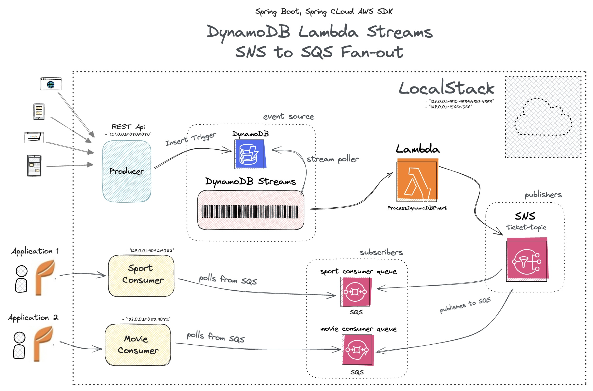
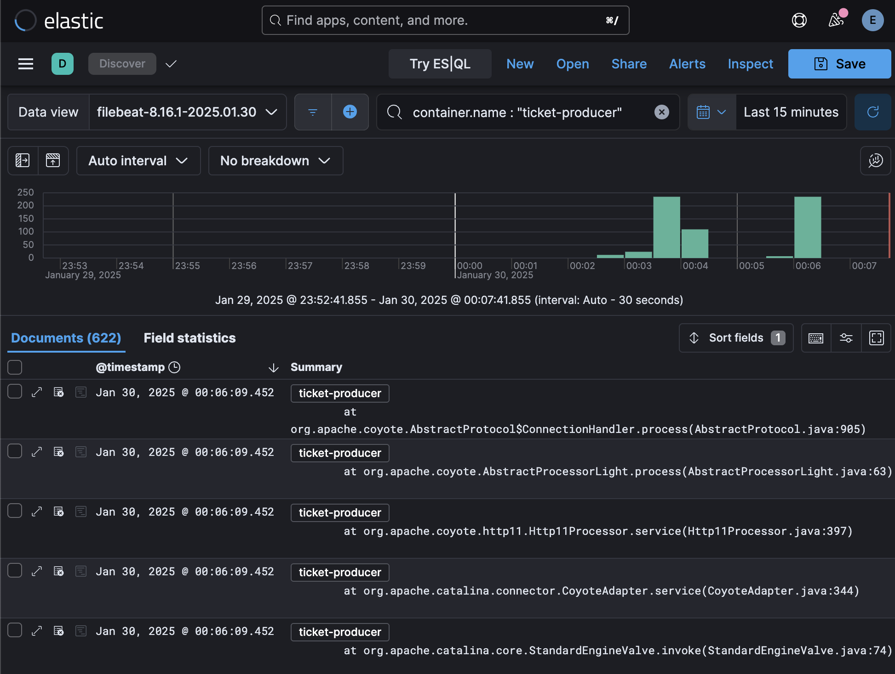
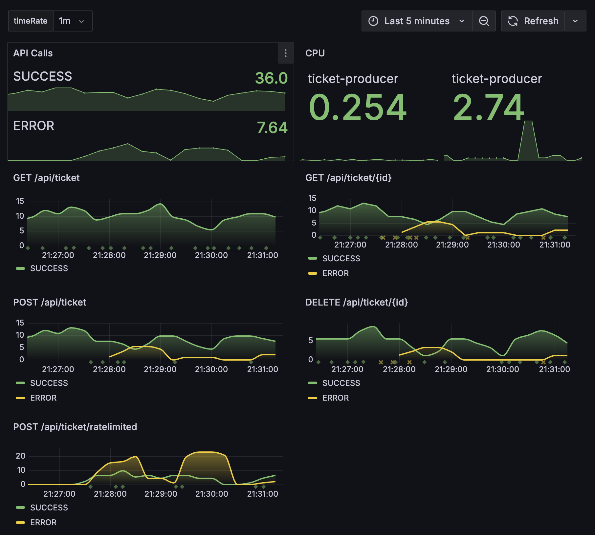
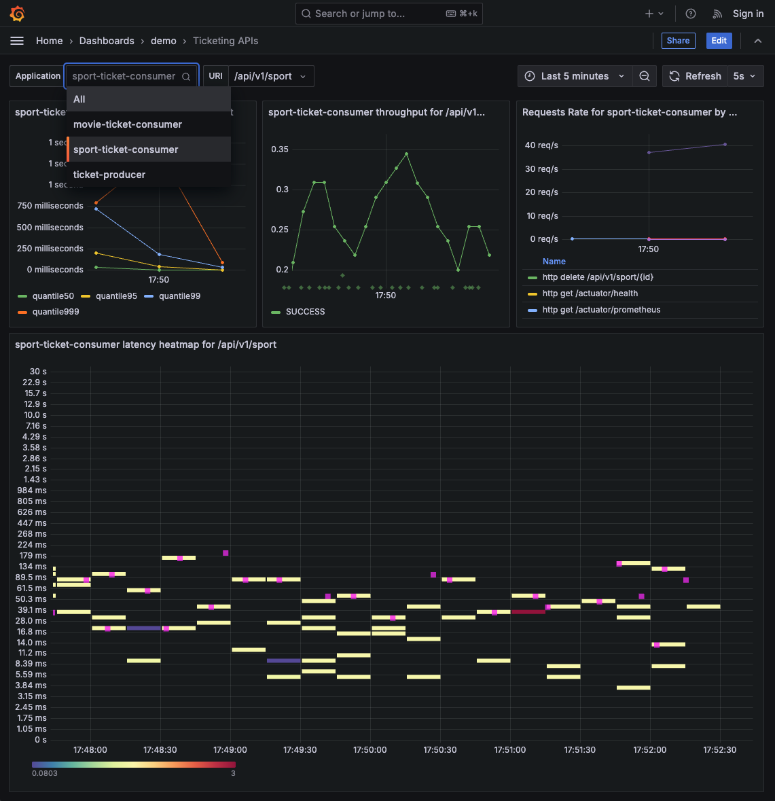

# SNS to SQS Fan-out with DynamoDB, Lambda, LocalStack, ELK, and Grafana

This project demonstrates an event-driven architecture where messages are sent to an SNS topic and "fan out" to multiple SQS queues. It ensures a fully decoupled approach with no data loss and the ability to scale by adding more SQS queues over time. Built as a Spring Boot multi-module application, it is fully containerized and runs in LocalStack, an AWS emulator that enables local development and testing, significantly reducing AWS development costs. 

Infrastructure build is done in the LocalStack [init ready hook](https://docs.localstack.cloud/references/init-hooks/)

## Features  

- **DynamoDB Streams**: Polls changes to DynamoDB tables.  
- **Lambda**: Processes DynamoDB stream events .  
- **SNS Notifications**: Publisher that sends notifications triggered by DynamoDB events to all subscribers.  
- **SQS Queue**: Subscriber that receives notifications and triggers consumer processing.  
- **LocalStack Integration**: Enables local development and testing of AWS services and saves you some money.
- **Rate Limited /api/ticket/ratelimited endpoint**: Spring Bootimplementation of rate limiting without additional dependencies.
- **Kibana & Grafana Visualization**
- **Open Telemetry**


## Pre-requisites
* [Java 21+](https://www.oracle.com/java/technologies/downloads/#java21) use [SDKMAN](https://sdkman.io/)
* [Maven](https://maven.apache.org/)
* [Docker](https://www.docker.com/get-started)

## Project Diagram


## Quickstart

- [Build](#build)
- [Run the project](#running-locally)
- [Run traffic](#running-traffic)
- [Kibana](#kibana)
- [Grafana](#grafana)
- [Postman](#postman)


## Build

1. Environment variables @ [.env](.env)
2. Build [Maven](https://maven.apache.org/) project
    ```
    mvn clean install
    ```
3. Package lambda
    ```
    ./scripts/package-lambda-function.sh
    ```
4. Use buildpack OCI [Docker](https://docs.docker.com/desktop/) images
    ``` sh
    ./scripts/build-docker-images.sh
    ```

## Running Locally

### Docker Compose

Kickoff the entire project and run all services behind the [LocalStack DNS Server](https://blog.localstack.cloud/2024-03-04-making-connecting-to-localstack-easier/) 

```
docker compose up --build
```

## Running Traffic
``` sh 
./scripts/run-traffic.sh
  ```
## Postman
Import [collection](./TicketingSystemAPIs.postman_collection.json) into Postman

## Kibana
http://localhost:5601



## Grafana
http://localhost:3000/




## Preview in Browser

| Application     | Type    | URL                                     |
|-----------------|---------|-----------------------------------------|
| `ticket-producer` | Swagger | http://localhost:9080/swagger-ui.html |
| `sport-ticket-consumer` | UI      | http://localhost:9081                  |
| `movie-ticket-consumer` | UI      | http://localhost:9082                  |

## Preview in H2 Console

| Application     | Type    | URL                                     |
|-----------------|---------|-----------------------------------------|
| `sport-ticket-consumer` | UI      | http://localhost:9081/h2-console               |
| `movie-ticket-consumer` | UI      | http://localhost:9082/h2-console                  |


## Shutdown

```
docker compose down -v --remove-orphans
```

## Cleanup

``` sh
./scripts/remove-docker-images.sh 
```
